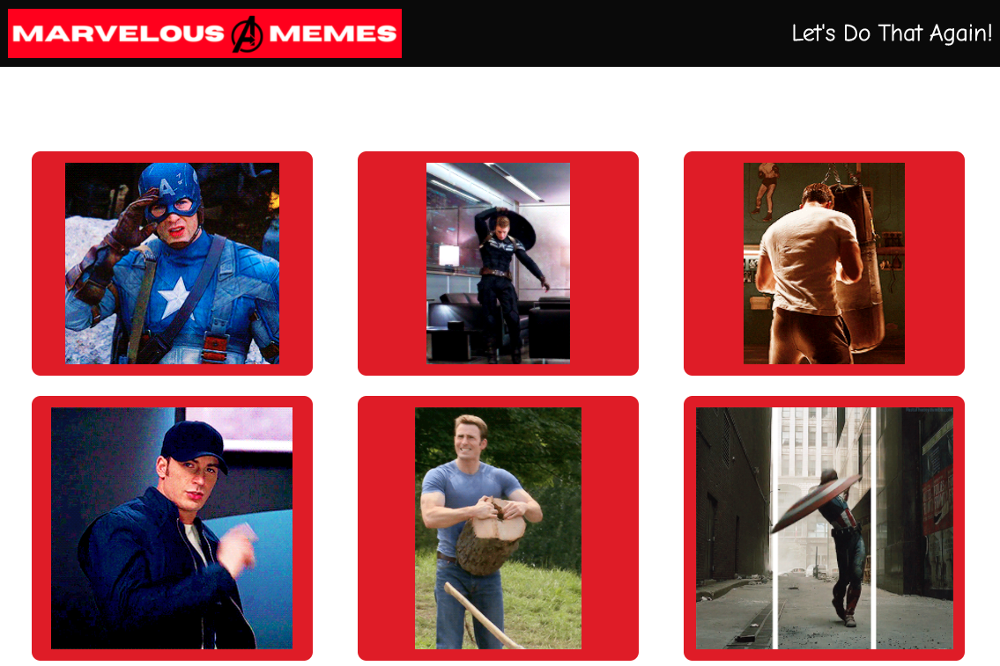

# 07 Project 1: Interactive Front-End Application

## Description
Our team (Enthusiastic Toucans) researched, developed and executed our concept to deliver a MVP within the time frame.
Our website allows users to select their favourite Marvel character and then be shown a selection of gifs in which their character is featured. 

The website uses two APIs:
Marvel API
Giphy API

## User Story

As a Marvel fan 
I want to be able to choose a favourite character
So that I can see some Gifs featuring that character.

## The Process
### Technologies Used
HTML, JavaScript and CSS
CSS Framework - Bulma and Google Fonts
APIs - Marvel & Giphy
Deployment - Github

### Breakdown of Tasks and Roles
ET (Enthusiastic Toucans) worked collectively to develop our concept and research which technologies we would use for our project. 
Ben - Developer (Functionality and server side APIs)
Alex - UI/UX Designer (Manifesting layouts and wireframes.)
Wilker - QA Engineer (Responsible for quality assurance and testing throughout the development stages)
Marcus - Project Manager (Planning, scheduling, coordinating and communicating)

### Challenges
API functionality was a big challenge for this project. We initially chose the Rotten Tomatoes API, but we ran into too many issues with access and compatibility with our Marvel API. 

Even when we found another API that would work for our project (Giphy) we still spent the majority of our time getting both API’s to function how we wanted them to.

### Successes
As it was our biggest challenge getting the APIs to function correctly it's safe to say that this was also our biggest success. 

We definitely had some fist pumping moments when we finally got both API’s working.

Delivering a MVP on time and supporting each other throughout the process was another huge success for the ET team.

## Directions for Future Development 
In the future you can expect to see Marvelous Memes grow in both the amount of characters you can choose from as well as the information that you get on each character. 

We would also like to update the styling and improve the card design.

### This application has been deployed at a live URL which you can see here: 
https://marcmalliate.github.io/Collaborative-Project/index.html

### You may also like to view the GitHub repository which contains the code repository: 
https://github.com/marcmalliate/Collaborative-Project

### Screenshot of application:

© 2021 Enthusiastic Toucans (Marc Malliate & Ben Clewer) Third-Party-APIs# Collaborative-Project
